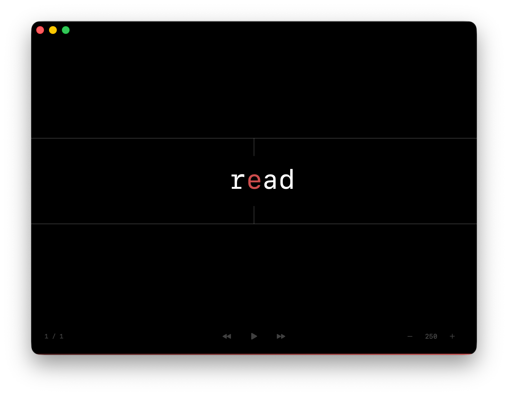
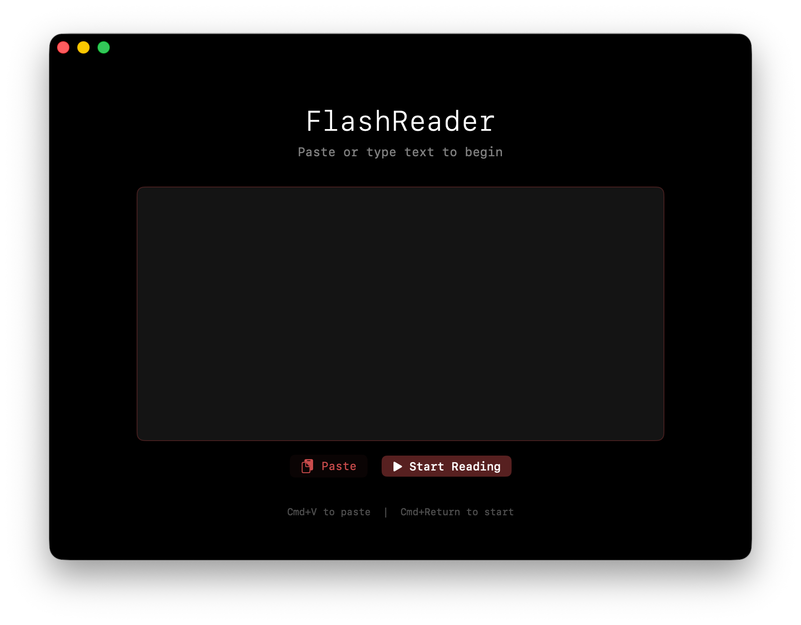

# FlashReader

**Read faster with less effort.** FlashReader displays text one word at a time, helping you focus and reduce eye movement. Great for articles, documents, or anything you want to get through quickly.



## Install

1. **[Download FlashReader](https://github.com/justinjlamb/FlashReader/releases/latest)** (click the `.zip` file)
2. Unzip and drag to Applications
3. First time opening: right-click the app → click "Open" → click "Open" again

> macOS shows a warning because the app isn't from the App Store. This is normal for free, open-source apps.

## How to Use



1. Open FlashReader
2. Paste any text (Cmd+V)
3. Click **Start Reading** (or Cmd+Return)
4. Press **Space** to pause/resume

## Controls

| Key | What it does |
|-----|--------------|
| Space | Pause / Resume |
| ↑ / ↓ | Speed up / Slow down |
| ← / → | Skip backward / forward |
| Esc | Stop and go back |
| ? | Show all shortcuts |

## Requirements

- macOS 14 (Sonoma) or newer
- That's it. No account, no internet, no tracking.

## Build from Source

<details>
<summary>For developers</summary>

Requires Xcode 15+.

```bash
git clone https://github.com/justinjlamb/FlashReader.git
cd FlashReader
xcodebuild -scheme FlashReader -configuration Release build
```

The app will be in `~/Library/Developer/Xcode/DerivedData/FlashReader-*/Build/Products/Release/`.

</details>

## License

MIT - Use it however you want.
